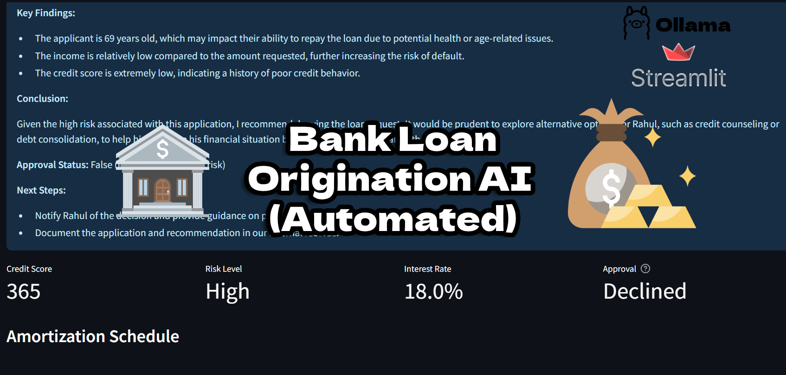

# Banking-Agent-POC
AI-powered loan origination system POC built with Streamlit. Automates loan application analysis, risk assessment, and approval using LLMs. Includes amortization schedules and downloadable PDF proposals.

# Banking Agent POC

A Proof-of-Concept (POC) for an AI-powered loan origination system built with Streamlit. This application demonstrates how Large Language Models (LLMs) can be used to automate and enhance the loan application process.

## Overview

This project simulates a loan origination system, allowing users to input their loan application details, which are then processed by an AI agent. The agent analyzes the application, generates a summary, assesses credit risk, determines loan offers, and provides an approval decision with a detailed reason.  The application also provides an amortization schedule, and allows downloading a PDF proposal with all the loan details.

## Features

*   **Loan Application Form:** An intuitive Streamlit form for users to input loan details.
*   **AI-Powered Analysis:** An AI agent processes the application, generating a summary and assessing risk.
*   **Credit Score and Risk Assessment:** Provides a credit score and risk level based on the application.
*   **Loan Offer Generation:** Determines the interest rate and loan terms based on the risk assessment.
*   **Approval Decision:** Automatically approves or declines the loan application with a clear reason.
*   **Amortization Schedule:** Generates and displays an amortization schedule to visualize loan repayment.
*   **Downloadable PDF Proposal:** Creates a downloadable PDF containing the loan details and approval status.
*   **Interactive Visualization:** Uses Plotly to create an interactive chart of the loan balance over time.
*   **Lottie Animation:** Displays a success animation for approved loans.
*   **Custom Styling:** Provides a professional user interface with custom CSS.

## Technologies Used

*   **Streamlit:** For building the web application interface.
*   **Streamlit Lottie:** For displaying Lottie animations.
*   **Pandas:** For data manipulation and creating the amortization schedule.
*   **Plotly:** For creating interactive charts and visualizations.
*   **AI Agent (LLM integration):** The core component for processing loan applications (implementation details in `agent.py`).
*   **PDF Generation Library:** For generating the downloadable PDF proposal (implementation details in `utils.py`).

## Setup and Installation

1.  **Clone the repository:**

    ```bash
    git clone <repository_url>
    cd Banking-Agent-POC
    ```

2.  **Create a virtual environment (recommended):**

    ```bash
    python3 -m venv venv
    source venv/bin/activate  # On Linux/macOS
    venv\Scripts\activate.bat  # On Windows
    ```

3.  **Install dependencies:**

    ```bash
    pip install -r requirements.txt
    ```

4.  **Environment Variables:**
    * This project might require environment variables to configure the AI Agent (LLM integration). Please check the `agent.py` file and the documentation of the used LLM provider for any required environment variables (e.g. API keys).
    *  Create a `.env` file in the root directory and define the necessary environment variables, e.g.:

    ```
    OPENAI_API_KEY=your_openai_api_key
    ```

    * Load the environment variables. One way to do this is using the `python-dotenv` package.  Add the following lines to your `agent.py` file:

    ```python
    from dotenv import load_dotenv
    load_dotenv()
    ```

5.  **Run the Streamlit application:**

    ```bash
    streamlit run app.py
    ```

## Code Structure

*   `app.py`:  The main Streamlit application file containing the UI and logic.
*   `agent.py`:  Contains the AI agent logic for processing loan applications and interacting with LLMs.
*   `utils.py`:  Contains utility functions for generating the amortization schedule and creating the PDF proposal.
*   `assets/`: Contains static assets such as the Lottie animation (`lottie_success.json`).
*   `requirements.txt`:  Lists the Python dependencies for the project.

## Usage

1.  Open the Streamlit application in your browser (usually at `http://localhost:8501`).
2.  Fill in the loan application form in the sidebar.
3.  Click the "Submit" button.
4.  The AI agent will process the application and display the results, including the loan committee summary, credit score, risk level, interest rate, approval status, amortization schedule, and a download link for the PDF proposal.

## Example Application



## Contributing

Contributions are welcome!  If you have suggestions for improvements or bug fixes, please submit a pull request.

1.  Fork the repository.
2.  Create a new branch for your feature or bug fix.
3.  Make your changes and commit them with descriptive messages.
4.  Submit a pull request.

## License

This project is licensed under the [MIT License](LICENSE).

## Future Enhancements

*   Implement more sophisticated risk assessment models.
*   Integrate with real-time credit scoring APIs.
*   Add support for different loan types and terms.
*   Enhance the PDF proposal with more detailed information and branding.
*   Improve the user interface and user experience.
*   Deploy the application to a cloud platform.
*   Add user authentication and authorization.
*   Add more robust error handling and logging.
*   Implement automated testing.
